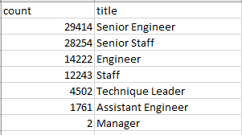
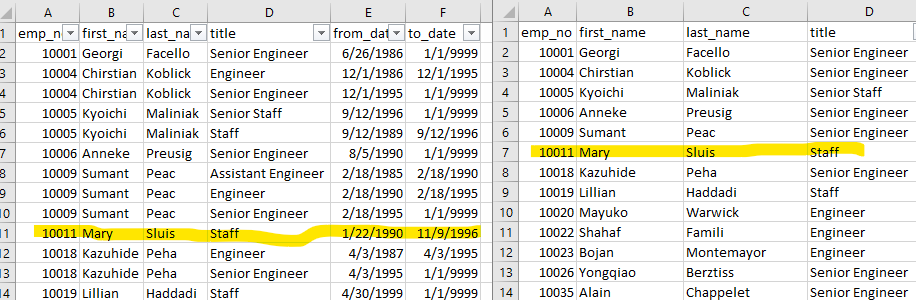
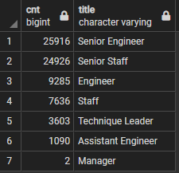
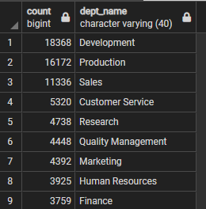
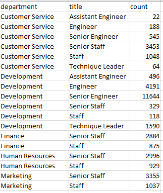

# Pewlett-Hackard-Analysis
Employee Database with SQL

## Overview of Analysis
Pewlett-Hackard will soon see a mass number of employees enter retirement age. In preparation for the possible mass exodus of employees, PH needs to determine:
-	The number employees who are retiring per title.
-	The employees eligible for the mentorship program to train others for future vacant positions. 

## Resources
**Data Sources:** departments.csv, dept_emp.csv , dept_manager.csv, employees.csv, salaries.csv, titles.csv

**Software:** PostgresSQL 11.13, pgAdmin 5

## Results
- Original results suggested 90,398 employees will enter retirement age. The number of possible retirements per title is depicted in image 1 below.
- The number of senior employees leaving accounts for more than 60% of those eligible for retirement. 
- Almost 30k employees are reaching retirement age who hold titles as Senior Engineer or Senior Staff. As the hierarchy decreases, the number of employees eligible for retirement decreases. The number possible retirees who are Engineers and Staff are about half of each of the former. Technique leaders accounts for 4,502 possible retirees and Assistant Engineers account for 1,761 possible retirees. Only 2 managers could possibly retire but this is an expected anomaly given that there are only 9 possible managers.

                                                                                                                                

**Image 1 Retirees per Title**

-	Looking at unique_titles I realized the table included employees **not currently** employed as some employees on deliverable 1 had definitive to-dates suggesting they are no longer employed with PH. Since they only had one title, that title and employee would be included in the unique list. See Image 2. In retiring_titles table, Mary is listed with one end date of ‘11/9/1996’ suggesting that Mary is no longer employed at PH. However, Mary is included in the unique_titles table which may be inaccurate. 

**Image 2**

-	After adjustment for current employees only 
  -	72,458 employees are entering retiring age.
  - 70% hold Senior Titles.
  - 2 Managers will be eligible for retirement.
  (See Image 3)

**Image 3 Revised Retirements by Title**

- There are a total of 1,549 employees eligible for the mentorship program.  

## Summary
-	A little over 70k roles will be open due to retirement with most of the retirees being senior roles this will have an immediate negative impact depending on length hiring process, the actual number of ppl who will retire, and the number of employees who retire around the same time. The mentorship program must come implemented immediately and increase the amount of new-hires to fill roles as others are promoted. If the hiring process is excessive this will also increase the length of time a position is vacant. 
-	Given that only 1,549 are eligible for the mentorship program but over 70k are retiring, this amount is inadequate and should be increased. One way to do this is to widen the range of birth years or age used to determine eligibility.
-	For more insight, additional table were created to show the number of possible retirements by department (Image 4) and the number of possible retirements by title per department (Image 5).
-	From image 4, Development will account for most of retirements with 18,368 employees entering retirement eligibility. Finance will have the least amount retiring. 

**Image 4 Retirements by Department**

-	Image 5 shows the number of employees grouped by title for each department. Looking at the table, Development has a many Senior Engineers eligible for retirement while Customer Service has 545 Senior Engineers eligible. Opening the csv file included in the Data folder, we can now see which departments are losing its managers, Sales and Research. This would be useful in that PH could know which deperatments and which roles are needed from one table.

**Image 5 Retirement per Department by Title**

